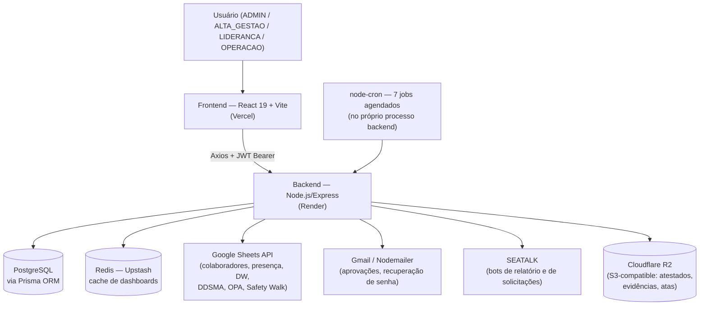
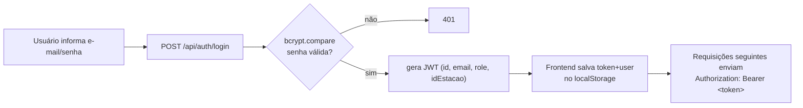
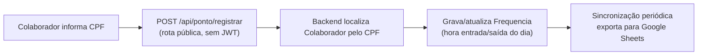
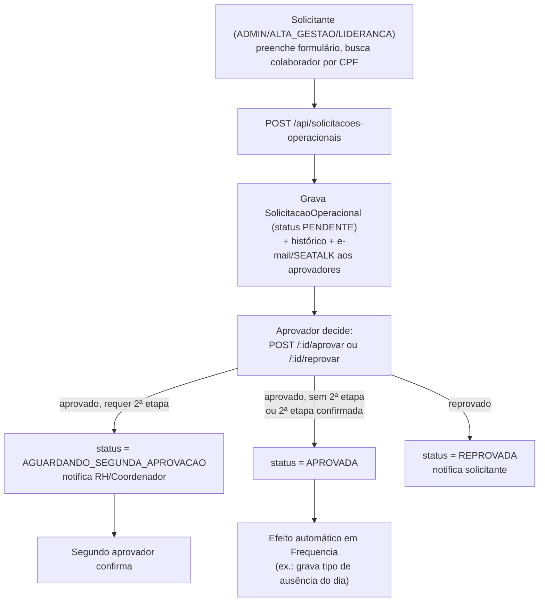
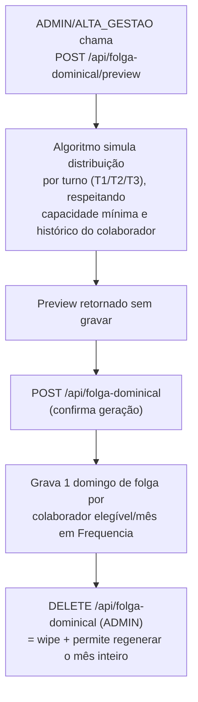
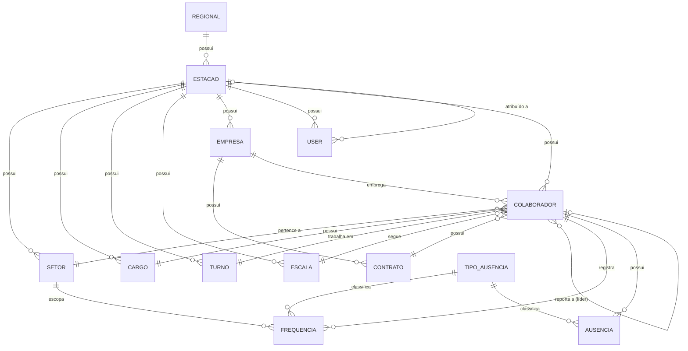

# Arquitetura e Referência Técnica — COPEOPLE

Documento técnico complementar ao [README](../README.md). Enquanto o README apresenta o produto, este documento é a referência para quem vai desenvolver, dar manutenção ou fazer onboarding técnico no projeto.

Todo o conteúdo abaixo foi extraído por auditoria direta do código-fonte (backend, frontend, schema Prisma, configuração e histórico de commits) — não presume comportamento não confirmado no código. Onde algo não pôde ser confirmado com certeza, está sinalizado com ⚠️.

---

## Índice

- [Visão geral do domínio](#visão-geral-do-domínio)
- [Arquitetura](#arquitetura)
- [Fluxos principais](#fluxos-principais)
- [Estrutura do projeto](#estrutura-do-projeto)
- [Tecnologias](#tecnologias)
- [Banco de dados](#banco-de-dados)
- [API](#api)
- [Pré-requisitos](#pré-requisitos)
- [Instalação](#instalação)
- [Variáveis de ambiente](#variáveis-de-ambiente)
- [Scripts disponíveis](#scripts-disponíveis)
- [Desenvolvimento](#desenvolvimento)
- [Testes](#testes)
- [Deploy](#deploy)
- [Segurança](#segurança)
- [Limitações / Pontos de atenção](#limitações--pontos-de-atenção)
- [Possíveis evoluções](#possíveis-evoluções-identificadas-durante-a-auditoria)

---

## Visão geral do domínio

O sistema atende operações de uma ou mais **estações** (unidades/sites, ex.: `SoC_PE_Jabotao_dos_Guararapes`), cada uma agrupada por uma **regional**. Todo dado organizacional (colaborador, setor, cargo, turno, escala, empresa) é opcionalmente escopado por `idEstacao`, e o controle de acesso reforça esse escopo por papel de usuário: `ADMIN` tem visão global (ou pode filtrar por estação via query param), `ALTA_GESTAO` e as demais roles ficam fixas na estação do próprio usuário.

**Papéis (roles):**
- **ADMIN** — acesso irrestrito, inclusive cadastro de estações/regionais e ações administrativas (reprocessamento de folga dominical, exportações manuais).
- **ALTA_GESTAO** — gestão completa dentro da própria estação.
- **LIDERANCA** — líderes de setor/turno; acesso operacional do dia a dia (colaboradores, presença, treinamentos, solicitações), sem acesso a cadastros organizacionais nem a aprovadores.
- **OPERACAO** — perfil restrito, bloqueado pelo middleware `blockOperacao` a apenas três áreas: registro de ponto (`/api/ponto`), autenticação (`/api/auth`) e o dashboard de Gestão Operacional.
- `USER`, `MANAGER` e `GESTAO` existem no enum `UserRole` do banco, mas não foram encontrados em nenhuma checagem de permissão (`authorize`/`authorizeRoles`) nas rotas auditadas — ⚠️ necessita validação se são usados em lógica de controller ou se são resquícios.

## Arquitetura



O frontend fala apenas com o backend (nenhuma chamada direta a Google Sheets/e-mail/SEATALK/R2 a partir do navegador — tudo passa pela API). O backend concentra todas as integrações externas e também roda os jobs agendados no mesmo processo (não há worker separado).

## Fluxos principais

### Login



### Registro de ponto (totem, sem login)



### Solicitação Operacional (ex.: Folga)



### Geração de Folga Dominical (mensal)



## Estrutura do projeto

Layout de duas pastas independentes (`backend/` e `frontend/`), cada uma com seu próprio `package.json`/`node_modules`, orquestradas por scripts de conveniência (`concurrently`) num `package.json` na raiz — **não** é um monorepo com workspaces npm/yarn/pnpm.

```
gestao-colaboradores/
├── package.json              # scripts de conveniência (dev/start/install/prisma para as duas pastas)
├── CHANGELOG.md              # changelog datado (não segue numeração semver estrita)
├── docs/                     # documentos técnicos (este arquivo + notas pontuais de DSR/absenteísmo)
│
├── backend/
│   ├── src/
│   │   ├── controllers/      # lógica de cada recurso (1:1 com routes)
│   │   ├── routes/           # ~45 arquivos de rotas Express, montados em routes/index.js
│   │   ├── services/         # integrações externas (Google Sheets, Redis, R2, SEATALK) e regras de negócio maiores (ex.: folgaDominical.service.js, dsrBackfill.service.js)
│   │   ├── jobs/             # 6 jobs node-cron (produção, exportações, DSR futuro, varredura de faltas)
│   │   ├── middlewares/      # auth, autorização por role/estação, rate limit, cache, tratamento de erro
│   │   ├── reports/          # geração/envio de e-mail (Nodemailer)
│   │   ├── utils/            # jwt, hash, resposta padronizada, helpers de data
│   │   ├── config/           # config.js (env vars) e database.js (Prisma client)
│   │   ├── app.js            # helmet, CORS, rate limit global, montagem de rotas, cron inline
│   │   └── server.js         # bootstrap: conecta banco, inicia jobs, listen
│   └── prisma/
│       ├── schema.prisma     # 44 models, 20 enums
│       └── migrations/       # ⚠️ gitignorado — não versionado no repositório (ver Limitações)
│
└── frontend/
    └── src/
        ├── pages/             # ~25 módulos de página (um por área do sistema)
        ├── components/        # componentes de UI reutilizáveis (inclui Sidebar)
        ├── services/          # 1 wrapper Axios por módulo de API (19 arquivos + instância base)
        ├── context/           # AuthContext, EstacaoContext, ThemeContext, SidebarContext
        ├── routes/            # ProtectedRoute (guarda de rota por role/estação)
        └── styles/globals.css # Tailwind v4 (import CSS-first) + tokens de tema claro/escuro
```

## Tecnologias

### Backend
| Categoria | Tecnologia |
|---|---|
| Runtime / Framework | Node.js + Express 4 |
| Banco de dados | PostgreSQL, via Prisma ORM 5 |
| Autenticação | JWT (`jsonwebtoken`) + bcrypt (10 salt rounds) |
| Cache | Redis via `@upstash/redis` |
| Object storage | Cloudflare R2 via `@aws-sdk/client-s3` (URLs pré-assinadas) |
| Planilhas | `googleapis` (Google Sheets API) |
| E-mail | `nodemailer` (Gmail) |
| Agendamento | `node-cron` |
| Segurança de borda | `helmet`, CORS com allow-list, `express-rate-limit` |
| Upload | `multer` (memória), `csvtojson` |
| Geração de documentos | `pdfkit`, `jspdf`, `xlsx` |
| Validação | `express-validator` |

### Frontend
| Categoria | Tecnologia |
|---|---|
| Framework | React 19 + Vite 7 |
| Roteamento | `react-router-dom` v7 |
| Estilo | Tailwind CSS v4 (CSS-first) + tokens próprios de tema claro/escuro |
| Componentes | Radix UI primitives (`dialog`, `dropdown-menu`, `select`, `tabs`, `tooltip`, `switch`, `avatar`) |
| Requisições | Axios (instância única com interceptors de auth e estação) |
| Estado remoto | `@tanstack/react-query` |
| Estado local/global | `zustand`, Context API |
| Formulários | `react-hook-form` + `zod` |
| Gráficos | `chart.js`/`react-chartjs-2`, `recharts` |
| Calendário | `react-big-calendar`, `react-day-picker` |
| Exportação/Relatórios | `exceljs`, `xlsx`, `jspdf`, `html2canvas`, `html2pdf.js`, `qrcode` |
| Notificações UI | `react-hot-toast`, `sonner` |
| Animação | `framer-motion` |

### Infraestrutura (confirmada em uso, não necessariamente versionada no repositório)
| Camada | Onde roda |
|---|---|
| Frontend | Vercel (`frontend/vercel.json` define o rewrite SPA) |
| Backend | Render — confirmado por observação direta do domínio de produção; **não há `render.yaml`, `Dockerfile` nem workflow de CI/CD no repositório**, então a configuração de deploy do backend não está versionada em código |
| Banco de dados | PostgreSQL gerenciado (mesma instância acessada por `DATABASE_URL`/`DATABASE_URL_ADMIN`) |
| Cache | Upstash Redis (serverless) |
| Storage de arquivos | Cloudflare R2 |

## Banco de dados

- **Tecnologia**: PostgreSQL.
- **ORM**: Prisma 5, com **duas connection strings** — `DATABASE_URL` (uso normal, provavelmente via pooler) e `DATABASE_URL_ADMIN` (`directUrl`, usada por migrations).
- **Escala do schema**: 44 models (41 "vivos" + 3 marcados `@@ignore` — tabelas de backup/staging sem chave única utilizável por Prisma Client) e 20 enums.
- ⚠️ **As migrations não são versionadas em git** — `backend/.gitignore` ignora `prisma/migrations/` explicitamente. O fluxo observado neste projeto é escrever o SQL da migration manualmente e aplicar direto no banco com `prisma migrate deploy`, sem ficar no histórico do repositório.

### Diagrama de entidades centrais

Mostra apenas o núcleo organizacional/RH — os módulos de Solicitação Operacional, Treinamento, Medida Disciplinar e Produção/DW foram omitidos aqui por espaço (documentados na íntegra em `backend/prisma/schema.prisma`).



> Nota: `User.opsId` **não** é uma relação Prisma formal com `Colaborador` — é apenas uma `String?` solta, sem `@relation`. Login de usuário do sistema e cadastro de colaborador (folha/RH) são entidades desacopladas.

### Famílias de modelos (visão geral)

| Família | Modelos principais |
|---|---|
| Organização | `Regional`, `Estacao`, `Empresa`, `Setor`, `Cargo`, `Escala`, `Turno`, `Contrato` |
| Colaborador | `Colaborador`, `HistoricoMovimentacao`, `Desligamento`, `ColaboradorEscalaHistorico` |
| Frequência/Ponto | `Frequencia`, `FrequenciaHistorico`, `TipoAusencia`, `Ausencia`, `AtestadoMedico` |
| Disciplinar/Acidentes | `MedidaDisciplinar`, `MatrizMedidaDisciplinar`, `SugestaoMedidaDisciplinar`, `AcidenteTrabalho`, `EvidenciaAcidente` |
| Treinamento | `Treinamento`, `TreinamentoParticipante`, `TreinamentoSetor`, `AprovadorTreinamento`, `SolicitacaoTreinamento`, `SolicitacaoTreinamentoParticipante`, `SolicitacaoTreinamentoHistorico` |
| Solicitação Operacional | `AprovadorOperacional`, `SegundoAprovadorOperacional`, `SolicitacaoOperacional`, `SolicitacaoOperacionalHistorico` |
| Produção / DW | `DwPlanejado`, `DwReal`, `FolgaDominical`, `ProducaoHoraHistorico`, `ProducaoColaboradorHistorico`, `FonteProducaoConfig`, `ExportColaboradoresConfig` |
| Acesso | `User` |
| Legado (`@@ignore`) | `colaborador_backup_202601`, `frequencia_backup_t3_bug_2026_01`, `stg_colaboradores_sheet` |

### Regras de integridade notáveis (`@@unique`)

- `Frequencia [opsId, dataReferencia]` — um registro de presença por colaborador por dia.
- `FolgaDominical [opsId, ano, mes]` — uma folga dominical por colaborador por mês.
- `DwPlanejado [data, idTurno, idEstacao]`, `ProducaoHoraHistorico [dataReferencia, turno, hora]`, `ProducaoColaboradorHistorico [dataReferencia, turno, opsId]`.
- `TreinamentoParticipante [idTreinamento, opsId]`, `SolicitacaoTreinamentoParticipante [idSolicitacao, opsId]`.
- `Empresa/Cargo/Escala/Turno` — nome único **por estação** (multi-tenant por estação, não globalmente único).

## API

Todas as rotas ficam sob o prefixo `/api`. Autenticação: header `Authorization: Bearer <token>`. Cinco rotas são públicas — as demais exigem JWT válido (middleware `authenticate`, aplicado globalmente em `routes/index.js`).

### Rotas públicas (sem autenticação)

| Método | Rota | Descrição |
|---|---|---|
| GET | `/api/health` | Health check |
| GET | `/api/env-check` | Presença (booleano) das variáveis de ambiente críticas |
| GET | `/api/version` | Versão da API |
| POST | `/api/auth/login`, `/register`, `/forgot-password`, `/reset-password` | Autenticação e recuperação de senha (rate-limited: 10 req/min/IP) |
| GET | `/api/auth/estacoes` | Lista de estações (para tela de cadastro) |
| POST | `/api/ponto/registrar` | Registro de ponto por CPF (uso em totens) |
| POST | `/api/atestados-medicos/presign-upload` | URL pré-assinada de upload (usa `optionalAuthenticate` no `POST /` de criação) |

### Autenticação e conta — `/api/auth`

| Método | Rota | Auth |
|---|---|---|
| POST | `/login`, `/register`, `/forgot-password`, `/reset-password` | pública |
| GET | `/estacoes` | pública |
| GET | `/me` | autenticado |
| PUT | `/me` | autenticado |
| PUT | `/change-password` | autenticado |

### Colaboradores — `/api/colaboradores`

| Método | Rota | Roles |
|---|---|---|
| GET | `/`, `/cpf/:cpf`, `/:opsId`, `/:opsId/stats`, `/:opsId/historico` | qualquer autenticado |
| GET | `/lideres`, `/escalas`, `/setores`, `/filtros`, `/export/csv` | ADMIN, ALTA_GESTAO, LIDERANCA |
| POST | `/import` | ADMIN, MANAGER, ALTA_GESTAO |
| GET | `/import-status` | ADMIN, MANAGER, ALTA_GESTAO |
| POST | `/` | ADMIN, MANAGER, ALTA_GESTAO |
| PUT | `/:opsId`, POST `/:opsId/movimentar` | ADMIN, MANAGER, ALTA_GESTAO |
| DELETE | `/:opsId` | ADMIN |
| POST | `/backfill-dsr`, `/backfill-nc-pre-admissao` | ADMIN |
| GET | `/export/status` (base `/api/colaboradores/export`) | qualquer autenticado |
| POST | `/export/agora` | ADMIN |

### Ponto e presença — `/api/ponto`, `/api/frequencias`, `/api/ausencias`

| Método | Rota | Roles |
|---|---|---|
| GET | `/api/ponto/controle` | autenticado |
| POST | `/api/ponto/ajuste-manual` | autenticado |
| GET | `/api/ponto/exportar-sheets` | autenticado |
| GET | `/api/frequencias`, `/:id` | qualquer autenticado |
| POST/PUT | `/api/frequencias`, `/:id`, `/:id/validar` | ADMIN, MANAGER |
| DELETE | `/api/frequencias/:id` | ADMIN |
| GET | `/api/ausencias`, `/ativas`, `/:id` | qualquer autenticado |
| POST/PUT | `/api/ausencias`, `/:id`, `/:id/finalizar` | ADMIN, MANAGER |
| DELETE | `/api/ausencias/:id` | ADMIN |

### Solicitações Operacionais — `/api/solicitacoes-operacionais`

Todas as rotas: ADMIN, ALTA_GESTAO, LIDERANCA.

| Método | Rota | Descrição |
|---|---|---|
| GET | `/colaborador` | autocomplete por CPF |
| GET | `/escalas`, `/calendario`, `/stats`, `/aprovaveis/ids` | listagens auxiliares |
| POST | `/sinergia/importar` | importação em massa via CSV |
| POST | `/` | cria solicitação |
| GET | `/`, `/:id` | lista / detalhe |
| POST | `/:id/aprovar`, `/:id/reprovar` | decisão |

Configuração de aprovadores: `/api/config/aprovadores-operacionais` e `/api/config/segunda-aprovacao-operacional` (CRUD completo, restrito a ADMIN/ALTA_GESTAO).

### Treinamentos — `/api/treinamentos`, `/api/solicitacoes-treinamento`

Todas as rotas: ADMIN, ALTA_GESTAO, LIDERANCA (import e aprovadores restritos a ADMIN/ALTA_GESTAO).

| Método | Rota | Descrição |
|---|---|---|
| GET | `/api/treinamentos`, `/:id`, `/stats`, `/participantes` | listagens |
| POST | `/api/treinamentos`, `/import` | criação / importação xlsx-csv |
| POST | `/api/treinamentos/:id/presign-ata`, `/upload-ata` | anexo de ata (PDF, R2) |
| PUT | `/api/treinamentos/:id/participantes` | edição de participantes |
| POST | `/api/treinamentos/:id/finalizar` 🚧 | marcado como legado no código |
| POST | `/api/treinamentos/:id/cancelar` | cancelamento |
| GET/POST | `/api/solicitacoes-treinamento/*` | fluxo de solicitação (mesmo padrão de Solicitações Operacionais) |
| GET/POST/PUT/DELETE | `/api/config/aprovadores-treinamento` | ADMIN, ALTA_GESTAO apenas |

### Folga Dominical — `/api/folga-dominical`

| Método | Rota | Roles |
|---|---|---|
| GET | `/` | ADMIN, ALTA_GESTAO, LIDERANCA |
| POST | `/preview` | ADMIN, ALTA_GESTAO |
| POST | `/` | ADMIN, ALTA_GESTAO |
| DELETE | `/` | ADMIN |

### Dashboards e relatórios

| Base | Cache/Rate limit | Roles declaradas na rota |
|---|---|---|
| `/api/dashboard` | `dashboardLimiter` + cache | qualquer autenticado |
| `/api/dashboard/admin` | cache | ADMIN, ALTA_GESTAO |
| `/api/dashboard/colaboradores`, `/atestados`, `/desligamento` | — | nenhuma declarada no arquivo de rota (depende só da cadeia global de auth) |
| `/api/dashboard/faltas`, `/absenteismo` | `reportLimiter` + cache | nenhuma declarada no arquivo |
| `/api/dashboard/gestao-operacional`, `/processamento-geral` | onlyEstacao([1]) | ADMIN, ALTA_GESTAO, LIDERANCA |
| `/api/spi` (frontend) → `/api/safety-walk`, `/api/ddsma`, `/api/opa` | onlyEstacao([1]) | qualquer autenticado (restrito por estação, não por role) |
| `/api/reports` | `reportLimiter` | envio de relatório por e-mail e por SEATALK |

### RH — Atestados, Medidas Disciplinares, Acidentes

| Base | Destaques |
|---|---|
| `/api/atestados-medicos` | `POST /` usa `optionalAuthenticate`; upload via presign R2 |
| `/api/medidas-disciplinares` | inclui envio de evidência por e-mail; sem `authorize` declarado no arquivo (cadeia global) |
| `/api/medidas-disciplinares/sugestoes` | aprovação/rejeição de sugestão automática, backfill administrativo |
| `/api/acidentes` | CRUD + evidências + cancelamento |

### Cadastros de referência (padrão CRUD idêntico)

`Empresas`, `Setores`, `Cargos`, `Contratos`, `Escalas`, `Turnos`, `Regionais`, `Estações`, `Tipos de Ausência` seguem todos o mesmo padrão: `GET /` e `GET /:id` liberados a qualquer autenticado; `POST`/`PUT`/`DELETE` restritos a `ADMIN` (+ `ALTA_GESTAO` na maioria, exceto `Estações`, `Contratos` e `Tipos de Ausência`, restritos só a `ADMIN`).

### Usuários — `/api/users`

| Método | Rota | Roles |
|---|---|---|
| GET | `/`, `/:id` | ADMIN, LIDERANCA |
| POST | `/`, PUT `/:id`, PATCH `/:id/status` | ADMIN |

### Daily Works — `/api/dw`

`POST/GET /planejado`, `/planejado/manual`, `/planejado/calculadora`, `/real`, `/resumo`, `/lista` — sem `authorize` declarado no arquivo (cadeia global de autenticação).

### Tratamento de erros e formato de resposta

- Sucesso: `{ success: true, data, message? }` (helpers em `utils/response.js`).
- Erro: `{ success: false, message }`; em `NODE_ENV=development`, também `stack` e o objeto de erro cru.
- Erros do Prisma são mapeados automaticamente: `P2002`→409, `P2025`/`P2001`→404, `P2003`/`P2014`/`P2000`→400; qualquer outro código Prisma ou erro genérico → 500.
- `asyncHandler` envolve praticamente todos os controllers para propagar rejeições de Promise ao middleware de erro.

## Pré-requisitos

```bash
Node.js
npm
PostgreSQL (ou acesso a uma instância gerenciada)
```

⚠️ Nenhuma versão mínima de Node/PostgreSQL está declarada em `engines` nos `package.json` — não confirmada.

## Instalação

```bash
git clone <url-do-repositório>
cd gestao-colaboradores

# instala as duas pastas de uma vez (usa os scripts da raiz)
npm run install:all

# configure backend/.env e frontend/.env.local (ver seção seguinte)

# aplica o schema no banco
npm run prisma:generate
npm run prisma:migrate

# sobe backend + frontend juntos
npm run dev
```

Backend em `http://localhost:3000` (porta padrão, configurável), frontend em `http://localhost:5173` (padrão do Vite).

## Variáveis de ambiente

Não existe `.env.example` no repositório — a lista abaixo foi extraída diretamente do código (`process.env.*`). **Nunca** commite os valores reais.

### Backend (`backend/.env`)

```env
# Núcleo — obrigatórias (o processo encerra se faltarem)
DATABASE_URL=
JWT_SECRET=

# Núcleo — opcionais
DATABASE_URL_ADMIN=      # usada como directUrl do Prisma (migrations)
NODE_ENV=
PORT=                    # padrão 3000
JWT_EXPIRES_IN=          # padrão 7d
LOG_LEVEL=                # padrão info
APP_VERSION=
FRONTEND_URL=             # usada para montar links em e-mails (ex.: reset de senha)

# E-mail (Gmail/Nodemailer)
GMAIL_USER=
GMAIL_APP_PASSWORD=

# Google Sheets (conta de serviço, compartilhada por todas as integrações)
GOOGLE_CLIENT_EMAIL=
GOOGLE_PRIVATE_KEY=

# Google Sheets — por integração
SHEETS_DDSMA_SPREADSHEET_ID=
SHEETS_DDSMA_ABA=
SHEETS_COLABORADORES_SPREADSHEET_ID=
SHEETS_COLABORADORES_ABA=
SHEETS_PRESENCA_SPREADSHEET_ID=
SHEETS_PRESENCA_ABA=
SHEETS_DAILY_WORKS_ABA=
SHEETS_DAILY_WORKS_INICIO=
SHEETS_OPA_SPREADSHEET_ID=
SHEETS_OPA_ABA=
SHEETS_SAFETY_WALK_SPREADSHEET_ID=
SHEETS_SAFETY_WALK_ABA=

# SEATALK — dois bots distintos
SEATALK_APP_ID=
SEATALK_APP_SECRET=
SEATALK_GROUP_ID=
SEATALK_SOLICITACOES_APP_ID=
SEATALK_SOLICITACOES_APP_SECRET=
SEATALK_SOLICITACOES_GROUP_ID=

# Cloudflare R2 (object storage, S3-compatible)
R2_ACCESS_KEY_ID=
R2_SECRET_ACCESS_KEY=
R2_ENDPOINT=
R2_REGION=
R2_BUCKET_NAME=
R2_WORKER_UPLOAD_URL=

# Redis (Upstash) — cache de dashboards
UPSTASH_REDIS_REST_URL=
UPSTASH_REDIS_REST_TOKEN=

# Jobs agendados
SYNC_ENABLED=                        # habilita sync de presença → Sheets
SYNC_INTERVAL_MINUTES=               # padrão 5
EXPORT_COLABORADORES_ENABLED=        # padrão habilitado (qualquer valor ≠ "false")
EXPORT_COLABORADORES_INTERVAL_HORAS= # padrão 2
```

### Frontend (`frontend/.env.local`)

```env
VITE_API_URL=   # ex.: http://localhost:3000 (o sufixo /api é adicionado pelo próprio código)
```

Esta é a **única** variável Vite referenciada em todo `frontend/src`.

## Scripts disponíveis

### Raiz (`package.json`)
```bash
npm run install:all      # instala backend + frontend
npm run dev               # backend + frontend simultâneos (concurrently)
npm run start              # idem, em modo produção
npm run build:frontend
npm run prisma:generate | prisma:migrate | prisma:studio   # atalhos para os comandos do backend
```

### Backend
```bash
npm run dev               # nodemon
npm start                  # node src/server.js
npm run build               # prisma generate
npm run check:env          # valida presença das variáveis de ambiente (scripts/check-env.js)
npm run prisma:generate | prisma:migrate | prisma:studio | prisma:seed
```
⚠️ O script `test:sheets` citado no README antigo **não existe mais** em `backend/package.json` — removido ou nunca existiu na versão atual do arquivo.

### Frontend
```bash
npm run dev
npm run build
npm run lint
npm run preview
```

## Desenvolvimento

- Cada `estacao` isola dados organizacionais; ao testar localmente, um usuário `ADMIN` pode alternar de estação via query param (`?estacaoId=`) ou ver tudo globalmente por padrão — os demais papéis ficam presos à própria `idEstacao`.
- **Migrations não ficam no git**: escreva o SQL manualmente em `backend/prisma/migrations/<timestamp>_nome/migration.sql`, depois rode `prisma migrate deploy` (não `migrate dev`, que tenta reconciliar histórico) e `prisma generate`. Isso foi confirmado repetidamente como o fluxo real usado neste projeto.
- O client Prisma gerado (`node_modules/.prisma/client/*.dll.node` no Windows) fica bloqueado enquanto o servidor `nodemon` está rodando — pare o processo antes de rodar `prisma generate` caso o comando falhe com `EPERM`.

## Testes

**Não há testes automatizados neste projeto.** Confirmado por ausência de:
- Arquivos `*.test.js`/`*.spec.js` em `backend/src` ou `frontend/src`.
- Pasta `__tests__` em qualquer lugar do repositório.
- Framework de teste (`jest`, `vitest`, `mocha`) nas dependências de qualquer um dos dois `package.json`.
- Script `test` em qualquer `package.json`.

## Deploy

| Camada | Onde | Config versionada? |
|---|---|---|
| Frontend | Vercel | `frontend/vercel.json` (rewrite SPA: todas as rotas → `index.html`) |
| Backend | Render — confirmado por observação direta do ambiente de produção durante manutenção deste projeto | **Não** — sem `render.yaml`/`Dockerfile`/workflow no repositório; presume-se configuração feita diretamente no painel do Render |
| Banco | PostgreSQL gerenciado, mesma instância para dev local e produção (`DATABASE_URL` aponta para o mesmo host observado em produção) | — |

⚠️ Importante para quem for desenvolver localmente: como o `.env` local historicamente aponta para o **mesmo banco de produção**, qualquer teste local com escrita (scripts `node -e`, geração de folga dominical, etc.) afeta dados reais. Considere usar um banco separado para desenvolvimento.

Não há pipeline de CI (sem `.github/workflows`) — não há lint/testes/build automatizados antes de um deploy.

## Segurança

O que está implementado (confirmado no código):
- Senhas com `bcrypt` (10 salt rounds); nunca armazenadas em texto plano.
- JWT assinado (HS256, padrão da lib), payload com `id`/`email`/`role`/`idEstacao`, expiração configurável (`JWT_EXPIRES_IN`, padrão 7 dias).
- Recuperação de senha com token de uso único: apenas o **hash SHA-256** do token fica no banco, o token em claro só existe no link do e-mail, expira em 1h, resposta da API é sempre genérica (não revela se o e-mail existe).
- `helmet()` com configuração padrão.
- CORS com allow-list explícita de origens (`localhost:5173`, `localhost:5174`, o domínio de produção no Vercel); requisições sem header `Origin` são permitidas (necessário para chamadas server-to-server/Postman, mas também reduz a proteção do allow-list nesse caso).
- Rate limiting (`express-rate-limit`, em memória — não distribuído): 300 req/min/IP global, 10 req/min/IP em `/auth`, mais limitadores dedicados para dashboards/relatórios/escrita definidos no middleware (não confirmado se todos os quatro limitadores extras estão de fato aplicados em todas as rotas pretendidas).
- Autorização em duas camadas: por `role` (`authorize`/`authorizeRoles`) e por `estacao` (`injectDbContext` + `onlyEstacao`).
- Upload de arquivos via URL pré-assinada (R2) — o backend não recebe o binário diretamente na maioria dos fluxos.

Pontos de atenção encontrados (ver também a seção seguinte):
- `JWT_SECRET` tem um valor literal de fallback (`'seu-segredo-jwt-aqui'`) no código caso a variável não esteja definida — mitigado na prática porque `config.js` derruba o processo se `JWT_SECRET` não estiver setada, mas o fallback não deveria existir de qualquer forma.
- Rate limiting em memória não sobrevive a reinício do processo nem é compartilhado entre múltiplas instâncias — não protege de fato um deploy com mais de um processo/instância.
- Vários grupos de rotas (dashboards de faltas/absenteísmo/colaboradores/atestados/desligamento, DW, esteiras, medidas disciplinares) não declaram `authorize`/`authorizeRoles` no próprio arquivo — ficam protegidos apenas pela autenticação JWT global, sem checagem de papel específica. Pode ser intencional (dado não sensível a papel), mas não há como confirmar a intenção pelo código.

## Limitações / Pontos de atenção

- **Zero cobertura de testes automatizados** — qualquer mudança depende de validação manual.
- **Migrations do Prisma não são versionadas em git** — histórico de schema não é rastreável via `git log`, dependendo inteiramente do estado do banco em produção.
- **Sem `.env.example`** — onboarding de um novo ambiente exige garimpar `process.env` no código para descobrir todas as ~40 variáveis necessárias (lista compilada acima, seção [Variáveis de ambiente](#variáveis-de-ambiente)).
- **Sem CI/CD e sem containerização** no repositório — deploy depende de configuração manual/externa não rastreada em código.
- **`User` e `Colaborador` são entidades desacopladas** — não há `@relation` formal entre `User.opsId` e `Colaborador.opsId`, o que pode gerar inconsistência entre "quem loga no sistema" e "quem é o colaborador" se não for mantido manualmente em sincronia.
- **`config.cors` em `config/config.js` está morto** — existe mas é explicitamente ignorado em `app.js` (comentário "CORS PADRÃO REMOVIDO"), que usa uma allow-list hardcoded e ligeiramente diferente (uma origem a mais: `localhost:5174`). Duas fontes de verdade para a mesma configuração é uma dívida técnica pequena, mas real.
- **Rotas com papéis inconsistentes** — módulos equivalentes têm exigências de role diferentes sem explicação óbvia no código (ex.: a maioria dos cadastros de referência aceita `ADMIN`+`ALTA_GESTAO` para escrita, mas `Estações`, `Contratos` e `Tipos de Ausência` aceitam só `ADMIN`).
- **Enums com valores não utilizados**: `TipoOcorrencia` e `Lateralidade` existem no schema mas os campos correspondentes em `AcidenteTrabalho` são `String` livre, não tipados a esses enums. Os papéis `USER` e `GESTAO` existem em `UserRole` sem uso encontrado em nenhuma checagem de autorização nas rotas.
- **`Treinamento.finalizarTreinamento` marcado como "legado"** no próprio código-fonte — sinal de fluxo em transição, não confirmado qual é o caminho atual recomendado.
- **Debug/instrumentação temporária em produção**: `app.js` tem um middleware de log específico para `POST /api/acidentes/presign-upload` comentado como temporário ("REMOVA APÓS RESOLVER"), e existe uma rota `GET /api/env-check` pública que expõe (como booleano, não valor) quais variáveis de ambiente sensíveis estão configuradas.
- **`gestaoOperacional.routes.js`** define duas rotas (`GET /status-salvamentos`, `POST /salvar-historico`) fisicamente depois de `module.exports = router` no arquivo-fonte — funciona porque `module.exports` é uma referência, mas é uma ordem de código incomum que vale revisar.
- **Um job roda fora de `src/jobs/`**: `app.js` agenda inline um cron (`gerarAusenciasDiaOperacional`, diário às 06:05) sem fuso horário explícito, diferente dos outros 6 jobs que especificam `America/Sao_Paulo` — inconsistência que pode causar deslocamento de horário conforme o fuso do servidor.

## Possíveis evoluções identificadas durante a auditoria

> Sugestões técnicas baseadas no que foi observado — não representam um roadmap oficial.

- Adicionar testes automatizados, ao menos para os fluxos mais sensíveis a regressão silenciosa (cálculo de presença/absenteísmo, geração de folga dominical, fluxo de aprovação de solicitações).
- Publicar um `.env.example` (sem valores) para acelerar onboarding.
- Mover o rate limiter para Redis (já disponível via Upstash) para que funcione de forma consistente entre instâncias/reinícios.
- Formalizar CI básico (lint + build) antes de deploy, já que o repositório não tem nenhum hoje.
- Resolver a duplicidade entre `config.cors` (não usado) e a allow-list hardcoded em `app.js`.
- Avaliar se vale linkar `User` e `Colaborador` via relação formal, para evitar drift entre conta de acesso e cadastro de RH.

---

*Documento gerado por auditoria direta do código-fonte. Atualize-o sempre que a arquitetura, rotas ou schema mudarem de forma relevante — ele tende a ficar defasado tão rápido quanto qualquer outra documentação se não for mantido junto do código.*
