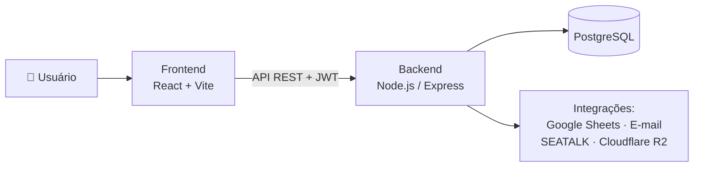

<div align="center">

# 🏢 COPEOPLE

### Gestão de força de trabalho para operações logísticas

*Colaboradores, ponto e presença, escalas, treinamentos, solicitações operacionais, medidas disciplinares e indicadores de segurança — tudo em um único lugar.*

[](#tecnologias)
[](#tecnologias)
[](#tecnologias)
[](#deploy)
[](docs/ARCHITECTURE.md)

</div>

---

## O que é

COPEOPLE é o sistema interno usado para operar o dia a dia de uma ou mais estações (unidades) logísticas: quem está trabalhando, quem tem folga, quem precisa de treinamento, quem cometeu uma não conformidade, quem se afastou — e como cada uma dessas decisões impacta a operação em tempo real.

Ele nasceu para substituir controle manual/planilha em processos que envolvem múltiplas pessoas decidindo sobre a mesma informação (líder, gestão e RH aprovando a mesma solicitação, por exemplo), e centraliza esses fluxos com regras de aprovação, histórico e notificação automática.

**Para quem é:**
- **Liderança de turno/setor** — rotina operacional: presença, escalas, solicitações do time.
- **Gestão e RH** — aprovações, medidas disciplinares, indicadores de absenteísmo e segurança.
- **Administração** — configuração de estações, cadastros organizacionais e operações administrativas sensíveis.

## Destaques

- 🕒 **Controle de presença** com registro de ponto por CPF (sem necessidade de login em totem), ajuste manual e status do dia calculado automaticamente (desligamento, afastamento, atestado, DSR).
- 📅 **Folga dominical automatizada** — geração mensal por algoritmo que distribui folgas de domingo respeitando capacidade operacional mínima por turno e o histórico de cada colaborador, com simulação (preview) antes de confirmar.
- 📝 **Solicitações operacionais em fluxo de aprovação** — folga, banco de horas, sinergia, troca de DSR, hora extra, troca de gestão/escala e desligamento, com aprovação em uma ou duas etapas (líder → RH/Coordenador quando aplicável) e notificação automática por e-mail e SEATALK.
- 🎓 **Treinamentos** com controle de participantes por setor, geração de ata em PDF e fluxo de solicitação com validação de conflito de horário.
- ⚖️ **Medidas disciplinares** com matriz configurável de violação × consequência, sugestão automática a partir de faltas detectadas e assinatura digital de evidência.
- 📊 **Dashboards operacionais** — absenteísmo, faltas, desligamentos, produção por turno/hora, e um painel de indicadores de segurança (Safety Walk, DDSMA, OPA) alimentado direto do Google Sheets.
- 🔐 **Controle de acesso por papel e por estação** — cada usuário só enxerga e decide sobre o que sua função e sua unidade permitem.

## Arquitetura



Documentação técnica completa (rotas de API, schema do banco, variáveis de ambiente, jobs agendados, limitações conhecidas) está em **[docs/ARCHITECTURE.md](docs/ARCHITECTURE.md)**.

## Tecnologias

| | |
|---|---|
| **Frontend** | React 19 · Vite · Tailwind CSS · React Query · React Hook Form + Zod · Radix UI |
| **Backend** | Node.js · Express · Prisma ORM · JWT · bcrypt |
| **Banco de dados** | PostgreSQL |
| **Infraestrutura** | Redis (Upstash, cache) · Cloudflare R2 (arquivos) · Google Sheets API · Nodemailer · SEATALK |
| **Deploy** | Vercel (frontend) · Render (backend) |

## Começando

```bash
git clone <url-do-repositório>
cd gestao-colaboradores

npm run install:all        # instala backend e frontend
# configure backend/.env e frontend/.env.local — ver docs/ARCHITECTURE.md

npm run prisma:generate
npm run prisma:migrate

npm run dev                 # backend em :3000, frontend em :5173
```

Guia completo de variáveis de ambiente, scripts e requisitos: **[docs/ARCHITECTURE.md](docs/ARCHITECTURE.md#instalação)**.

## Documentação

| | |
|---|---|
| 📐 [Arquitetura e referência técnica](docs/ARCHITECTURE.md) | Rotas de API, schema do banco, fluxos, variáveis de ambiente, segurança e limitações conhecidas |
| 📋 [Changelog](CHANGELOG.md) | Histórico de mudanças por versão |

## Autor

Desenvolvido e mantido por **Lucas Robson**.

## Licença

ISC.
